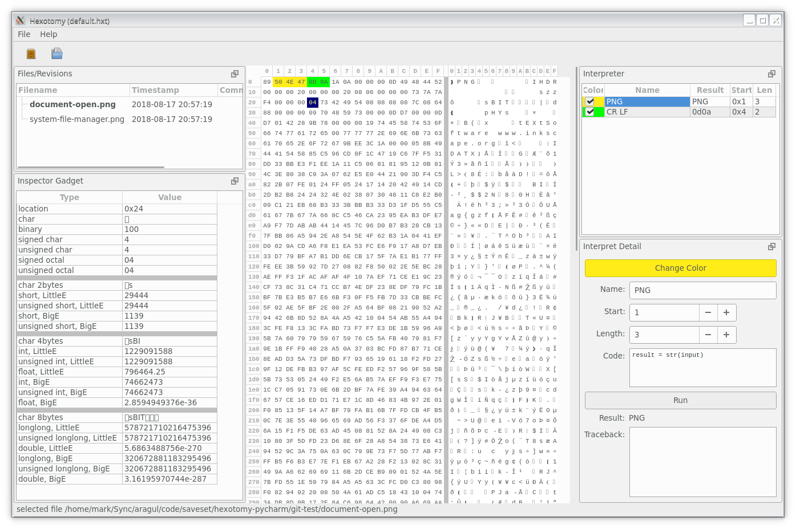

# hexotomy
A hex viewer for comparing small binary files between multiple snapshots

This project was built in September 2015 and quickly abandoned. It only works with small files.
Uses Python 2.7 and requires PySide.

